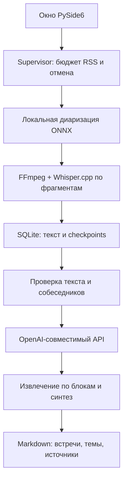

# Архитектура

GUI не держит тяжёлые модели. Supervisor запускает worker в собственной группе процессов и наблюдает суммарный RSS GUI и потомков. Отмена или превышение порога уничтожает группу, включая FFmpeg/Whisper/ONNX. Один экземпляр приложения защищён QLockFile.

Данные задач хранятся в SQLite WAL. Фрагмент распознавания и его checkpoint фиксируются одной транзакцией, повторный запуск не дублирует тот же фрагмент. Стабильные ID реплик используются в ссылках сводки. Диаризация выполняется до распознавания один раз; её результат сохраняется. После неё отдельный процесс освобождает модели.

Настройки распознавания фиксируются при первом запуске задачи. При продолжении можно изменить бюджет, потоки и модель Whisper; размер фрагмента, режим говорящих и язык сохраняются. Для изменения этих параметров нужно добавить запись заново. Настройки API можно изменять перед повторной сводкой; кэш блока зависит от адреса chat/completions, модели, инструкций и текста. Ручное редактирование текста/говорящих сбрасывает кэш сводки.

Клиент собирает URL Chat Completions из base URL. Требует HTTPS везде, кроме localhost, проверяет сертификат по системному хранилищу ОС через truststore (корпоративный CA из Keychain принимается, проверка не ослабляется), HTTP-статус, размер ответа, finish_reason, структуру JSON и ID источников. Ограничивает ответы 2 МБ. Повторяет сетевые ошибки и 429/502/503/504 до трёх попыток с задержкой. Не логирует заголовки или ответы ошибки. Не следует редиректам и не использует публичный запасной сервис.

Запросы разбиты по символам, а не токенам. Это предсказуемо ограничивает размер текста без зависимости от токенизатора конкретной модели; параметр нужно подобрать под контекст выбранной модели. В системных инструкциях и ответе также нужны токены. Начальное значение 12 000 символов + до 3 000 токенов ответа рассчитано на модели с достаточным окном контекста, а не универсально на любой API. Ответ с `finish_reason: length` отклоняется целиком, а не сохраняется обрезанным: обрыв на середине JSON означал бы потерю пунктов. Лечится уменьшением блока или увеличением лимита ответа (потолок — 64 000 токенов). Рассуждающие модели тратят на скрытые рассуждения тот же лимит, поэтому им нужен запас больше ожидаемой длины сводки.

Полный реестр исходных пунктов сохраняется отдельно от сокращённого синтеза. Проверка ссылок не является проверкой смысловой корректности. Произвольные команды из текста не исполняются: модель не получает инструментов, доступа к файловой системе и способности выполнять HTTP-запросы от имени приложения.
