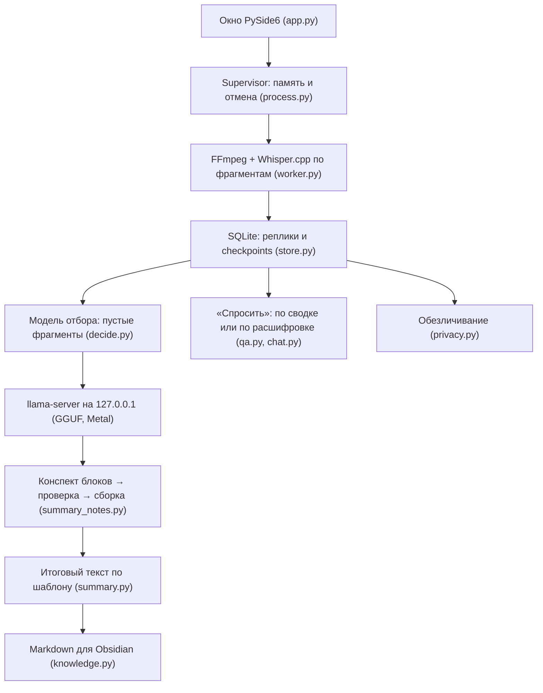

# Архитектура

```mermaid
flowchart TD
    UI["Окно PySide6 (app.py)"] --> W["Supervisor: память и отмена (process.py)"]
    W --> A["FFmpeg + Whisper.cpp по фрагментам (worker.py)"]
    A --> DB["SQLite: реплики и checkpoints (store.py)"]
    DB --> D["Модель отбора: пустые фрагменты (decide.py)"]
    D --> C["llama-server на 127.0.0.1 (GGUF, Metal)"]
    C --> N["Конспект блоков → проверка → сборка (summary_notes.py)"]
    N --> F["Итоговый текст по шаблону (summary.py)"]
    F --> KB["Markdown для Obsidian (knowledge.py)"]
    DB --> Q["«Спросить»: по сводке или по расшифровке (qa.py, chat.py)"]
    DB --> P["Обезличивание (privacy.py)"]
```

## Процессы и память

GUI не держит тяжёлые модели. Каждая задача — распознавание, догоняющее распознавание
live-записи, повторный проход, сводка, итоговый текст, экспорт — запускается отдельным
процессом `worker` (в готовом приложении — тот же исполняемый файл с `--run-module`) в
собственной группе процессов. Supervisor раз в 100 мс считает память GUI и всех потомков:
на macOS — физический объём процесса (`phys_footprint`, включает память Metal), иначе RSS.
Отмена или превышение 90% бюджета останавливает всю группу, включая FFmpeg, Whisper и
llama-server. Один экземпляр приложения защищён QLockFile.

## Данные

SQLite в режиме WAL. Фрагмент распознавания и его checkpoint фиксируются одной транзакцией,
поэтому продолжение не дублирует текст. У реплик стабильные ID: на них ссылаются сводка,
вопросы, обезличивание и заметки. Промежуточные шаги сводки (`summary-*` checkpoints)
сохраняются с хешем входа — модели, промптов, текста — и переиспользуются при продолжении;
«Сделать сводку заново» их удаляет. Ручная правка расшифровки сбрасывает сводку.

Настройки распознавания фиксируются при первом запуске задачи: продолжение использует ту же
модель, язык, VAD и план фрагментов. Новая модель — «Распознать заново» (новая запись).

## Модель сводок

На время задачи `worker` запускает `llama-server` (llama.cpp, `local_llm.py`): только
`127.0.0.1`, свободный порт, одноразовый ключ, без системных прокси и редиректов. Слотов —
сколько позволяет память (до 4), KV-кэш 8-битный, модель целиком на GPU, спекулятивное
декодирование `ngram-mod`. Если сервер не стартует с ускорениями — обычный запуск с одним
слотом. Окно контекста считается под самый большой запрос конвейера (`context_tokens`),
перед стартом проверяется, что модель помещается в 85% памяти Mac.

Каждый запрос измеряется токенизатором модели (`/tokenize`): запрос без места на ответ не
отправляется, а делит свой материал. Ответы ограничены грамматикой GBNF: JSON для
классического алгоритма, строки пунктов для конспекта. Сервер запущен с
`--skip-chat-parsing` (иначе обрыв ответа на лимите давал HTTP 500 вместо `length`) и
`--special` (особые токены конца реплики видны как текст и ловятся стоп-списком).

Экспериментальный движок MLX (`mlx_server.py`) отвечает тем же API; при любом сбое
задача продолжается на llama.cpp.

## Конвейер сводки (алгоритм «конспект»)

1. **Подготовка.** Расшифровка чистится от пауз, заиканий и слов-паразитов (`speech.py`);
   маленькая модель отбора убирает приветствия и проверку связи (`decide.py`).
2. **Конспект блоков**, параллельно по слотам: модель читает строки `[id] текст` и пишет
   строки пунктов `Вид [id] текст | отв | срок | статус`, последняя строка — «КОНЕЦ».
3. **Проверка блока**: тот же текст в начале запроса (берётся из кэша сервера), модель пишет
   только исправления. Каждый пункт должен ссылаться на реплики своего блока.
4. **Сборка**: краткая сводка и пересмотры решений — один запрос по всему реестру; не
   помещается — многоуровневое объединение классического алгоритма.
5. **Итоговый текст** по шаблону пользователя — из самого подробного реестра, который
   помещается в запрос, с продолжением при обрыве.

`Budget` в `summary_notes.py` укладывает всё это в «Время на сводку»: меряет скорость модели
по `timings` ответов сервера и, если не успевает, пропускает проверку оставшихся блоков,
затем пишет конспект короче. Подробности и цифры — [руководство по моделям](models.md).

Классический алгоритм (`summary.py`: JSON-реестры, полная проверка, объединение по
уровням) остаётся для сравнения.

## Вопросы по записи

`chat.py` держит свой `llama-server`, пока идёт разговор (выгружает после 10 минут тишины и
перед задачей сводки). По сводке модель видит пронумерованные пункты сводки; по расшифровке —
всю расшифровку с номерами и временем в начале запроса, поэтому со второго вопроса она
берётся из кэша. Окно для этого расширяется по памяти Mac (до 64 тыс. токенов); не
помещается — реплики, найденные по словам вопроса, с соседями. Ответ показывается, только
если ссылается на существующие пункты или реплики.

## Безопасность

Модель не получает инструментов, доступа к файлам и сети; команды внутри расшифровки —
данные, а не инструкции. Проверка ссылок гарантирует существование источника, но не
смысловую верность пересказа.
