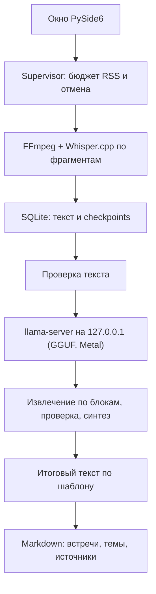

# Архитектура

```mermaid
flowchart TD
    UI["Окно PySide6"] --> W["Supervisor: бюджет RSS и отмена"]
    W --> A["FFmpeg + Whisper.cpp по фрагментам"]
    A --> DB["SQLite: текст и checkpoints"]
    DB --> R["Проверка текста"]
    R --> C["llama-server на 127.0.0.1 (GGUF, Metal)"]
    C --> S["Извлечение по блокам, проверка, синтез"]
    S --> F["Итоговый текст по шаблону"]
    F --> KB["Markdown: встречи, темы, источники"]
```

GUI не держит тяжёлые модели. Supervisor запускает worker в собственной группе процессов и наблюдает суммарный RSS GUI и потомков. Отмена или превышение порога уничтожает группу, включая FFmpeg/Whisper. Один экземпляр приложения защищён QLockFile.

Данные задач хранятся в SQLite WAL. Фрагмент распознавания и его checkpoint фиксируются одной транзакцией, повторный запуск не дублирует тот же фрагмент. Стабильные ID реплик используются в ссылках сводки.

Настройки распознавания фиксируются при первом запуске задачи. При продолжении можно изменить бюджет, потоки и модель Whisper; размер фрагмента и язык сохраняются. Для изменения этих параметров нужно добавить запись заново. Модель сводок, указания и шаблон можно менять перед повторной сводкой; кэш блока зависит от файла модели (имя и размер), системного промпта с указаниями пользователя, лимитов и текста. Ручное редактирование текста сбрасывает кэш сводки.

**Локальная модель сводок.** На время задачи сводки worker запускает `llama-server` (llama.cpp) дочерним процессом: только на `127.0.0.1`, на свободном порту, с одноразовым ключом, одним слотом (`--parallel 1`), так что системный промпт остаётся в кэше между запросами. Сервер — часть группы процессов задачи: отмена или превышение бюджета памяти останавливает и его. Окно контекста считается из размера блока (`context_tokens`), бюджет памяти задачи — из размера файла модели и KV-кэша (`job_budget_gb`); перед запуском приложение проверяет, что модель помещается в память этого Mac. Сеть не используется: клиент не читает системные прокси и не следует редиректам.

JSON ответов ограничен GBNF-грамматикой llama.cpp (`grammar` в запросе) — модель физически не может выдать не-JSON. Сервер запускается с `--skip-chat-parsing`: собственный разборщик формата чата в llama.cpp при обрыве JSON на лимите отвечал HTTP 500 вместо `finish_reason: length`, а конвейеру нужен именно сигнал обрыва — по нему блок делится пополам. Переполнение контекста (HTTP 400) обрабатывается так же. Теги `<think>` рассуждающих моделей вырезаются.

Запросы разбиты по символам, а не токенам. Для расчёта контекста берётся консервативно 2 символа на токен. Ответ с `finish_reason: length` отклоняется целиком, а не сохраняется обрезанным: обрыв на середине JSON означал бы потерю пунктов.

**Итоговый текст** — отдельный этап после краткой сводки. Он получает не сырую расшифровку, а проверенный реестр пунктов с таймкодами и итоговыми статусами решений, и пишет Markdown по шаблону пользователя. Для длинных записей выбирается самый подробный материал, который помещается в один запрос: полный реестр с обзорами частей → полный реестр → промежуточные уровни сжатия → краткая сводка. Сбой этого этапа не теряет остальные сводки. Фаза `final` пересоздаёт только его из сохранённой сводки.

Полный реестр исходных пунктов сохраняется отдельно от сокращённого синтеза. Проверка ссылок не является проверкой смысловой корректности. Произвольные команды из текста не исполняются: модель не получает инструментов, доступа к файловой системе и способности выполнять HTTP-запросы от имени приложения.
